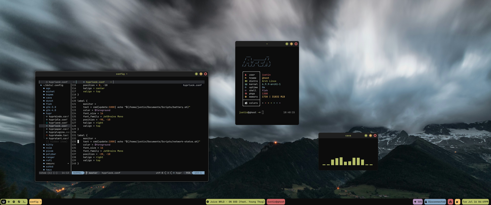

# publicdots

My public Hyprland dotfiles configuration.



## Overview

This repository contains my Wayland/Hyprland desktop configuration including:

- **Compositor**: Hyprland with custom bindings and workspace management
- **Terminal**: Ghostty with custom theming
- **Editor**: Neovim with modern plugin setup
- **Launcher**: Rofi with custom applets
- **Notifications**: SwayNC with custom styling
- **Multiplexer**: Tmux with fuzzy session switching
- **Status bar**: Waybar with custom modules
- **Theming**: Pywal integration

## Included Configurations

### Config Directories (.config/)
- `fish/` - Fish shell configuration
- `ghostty/` - Terminal emulator configuration
- `hypr/` - Hyprland compositor settings, keybinds, startup apps
- `nvim/` - Neovim with lazy.nvim plugin manager
- `rofi/` - Application launcher with custom applets
- `swaync/` - Notification daemon styling
- `tmux/` - Terminal multiplexer with plugins
- `wal/` - Pywal color scheme hooks
- `waybar/` - Status bar configuration

### Scripts (scripts/)
24 utility scripts for system management:
- Wallpaper management: `wallpaper.sh`, `wal.sh`
- Screen locking: `lock.sh`
- Theme switching: `dark_light_toggle.sh`
- Media controls: `goplaying-drop.sh`, `spotify-notify.py`, `whatsong.sh`
- System monitoring: `updates.sh`, `whoami.sh`, `batt.sh`
- Screenshots: `grim.sh`, `grimfull.sh`
- Volume control: `vol2.sh`
- And more...

## Installation

### Using GNU Stow (Recommended)

```bash
# Clone the repository
git clone https://github.com/justinmdickey/publicdots.git ~/publicdots

# Use stow to symlink configs to ~/.config/
cd ~/publicdots
stow --adopt .
```

The `--adopt` flag will:
- Create symlinks from `~/.config/*` pointing to `~/publicdots/.config/*`
- If you have existing configs, they'll be moved into the repo (adopted)

A `.stow-local-ignore` file excludes non-config files (scripts/, README.md, etc.) from being stowed.

### Manual Install

```bash
# Clone the repository
git clone https://github.com/justinmdickey/publicdots.git ~/publicdots

# Option 1: Symlink configs
ln -sf ~/publicdots/.config/hypr ~/.config/hypr
ln -sf ~/publicdots/.config/waybar ~/.config/waybar
# ... repeat for other configs you want

# Option 2: Copy configs (if you want to modify without tracking)
cp -r ~/publicdots/.config/hypr ~/.config/
cp -r ~/publicdots/.config/waybar ~/.config/
# ... repeat for other configs
```

### Scripts

The configurations reference scripts at `~/publicdots/scripts/`. Since the repo should be cloned to `~/publicdots`, scripts will work automatically.

If you clone to a different location, update the script paths:
```bash
cd ~/your-location/.config
find . -type f -exec sed -i 's|~/publicdots/scripts/|~/your-location/scripts/|g' {} \;
```

### Dependencies

```bash
# Install all dependencies (Arch Linux)
yay -S hyprland hyprlock hypridle hyprpaper \
       waybar rofi-wayland swaync \
       ghostty neovim tmux fish \
       python-pywal \
       grim slurp \
       pamixer wireplumber \
       brightnessctl playerctl \
       swww sassc \
       stow \
       ttf-maple ttf-jetbrains-mono-nerd ttf-font-awesome
```

**Core:**
- `hyprland` - compositor
- `hyprlock`, `hypridle`, `hyprpaper` - lock screen, idle daemon, wallpaper
- `waybar` - status bar
- `rofi-wayland` - application launcher
- `swaync` - notification daemon
- `ghostty` - terminal (AUR)
- `neovim` - editor
- `tmux` - terminal multiplexer
- `fish` - shell
- `python-pywal` - color scheme generator

**Utilities (used by scripts):**
- `grim`, `slurp` - screenshots
- `pamixer`, `wireplumber` - audio control
- `brightnessctl` - backlight control
- `playerctl` - media controls
- `swww` - wallpaper daemon (AUR)
- `sassc` - SCSS compilation for swaync

**Fonts:**
- `ttf-maple` - Maple Mono NF (AUR) - primary monospace font
- `ttf-jetbrains-mono-nerd` - JetBrains Mono Nerd Font - alternative mono
- `ttf-font-awesome` - Font Awesome 6 icons

## Customization

### Adjusting Paths

If you clone to a different location, update script paths:

```bash
# Update all config files to point to your script location
cd ~/publicdots/.config
find . -type f -exec sed -i 's|~/publicdots/scripts/|/your/path/|g' {} \;
```

### Note on Hardcoded Paths

Some SCSS/CSS files contain hardcoded paths to `~/.cache/wal/` for Pywal color imports. These cannot use shell variables. Options:
1. Run `pywal` which regenerates these files with correct paths
2. Manually update the paths in `.scss` and `.css` files
3. Use a sed command: `find . -name "*.scss" -exec sed -i 's|/home/justin|/home/yourusername|g' {} \;`

### Theming

Colors are managed by Pywal. To change theme:
```bash
wal -i /path/to/wallpaper.jpg
~/publicdots/scripts/wallpaper.sh --pick
```

## File Structure

```
publicdots/
├── .config/              # Application configurations (stowed to ~/.config/)
│   ├── fish/
│   ├── ghostty/
│   ├── hypr/
│   ├── nvim/
│   ├── rofi/
│   ├── swaync/
│   ├── tmux/
│   ├── wal/
│   └── waybar/
├── scripts/              # Utility scripts (not stowed, referenced directly)
├── images/               # Screenshots and assets
├── .gitignore            # Security safeguards
├── .stow-local-ignore    # Excludes non-config files from stow
└── README.md             # This file
```

## Key Bindings

Some notable Hyprland keybindings (Super = Mod key):

| Key | Action |
|-----|--------|
| Super+W | Pick wallpaper |
| Super+Shift+W | Random wallpaper |
| Super+L | Lock screen |
| Super+G | Toggle gaps |
| Super+Shift+L | Toggle dark/light theme |
| Super+S | Screenshot (full) |
| Super+Shift+S | Screenshot (select area) |
| Super+M | Music dropdown |

See `.config/hypr/hyprbinds.conf` for full keybinding list.

## License

Feel free to use and modify these configurations for your own setup.
